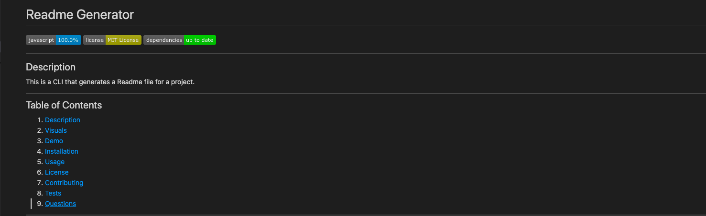

# Readme Generator
    
  
  ---

  
  ## Description
  This is a CLI that generates beautiful README.md files

  ---
  ## Table of Contents
  
  1. [ Description ](#description)
  2. [ Visuals ](#visuals)
  3. [ Demo](#demo)
  4. [ Installation](#installation)
  5. [ Usage ](#usage)
  6. [ License ](#license)
  7. [ Contributing ](#contributing)
  8. [ Tests ](#tests)
  9. [ Questions ](#questions)

  ---

  ## Visuals

  Screenshot of Project
  

  ---

  ## Demo

  Checkout the [demo page](./readme-generator-demo.mov) to see Readme Generator in action.

  ---

  ## Installation

  
  Just run the following command at the root of your project:

  npm install

  ---

  ## Usage

  Just run the following command at the root of your project and answer questions:

  node  index.js
  
  ---

  ## License

  Copyright (c) 2020, Andrew Crow. (MIT License)

  ---

  ## Contributing

  We are currently not allowing outside contributors to this project, but check back because things can change.

  ---

  ## Tests

  Currently no tests available

  ---

  ## Questions

  If you have questions you can reach me here:
  
  Email: andrew@crow.me

  GitHub: [Github Profile](https://github.com/crowandrew)

  ---

